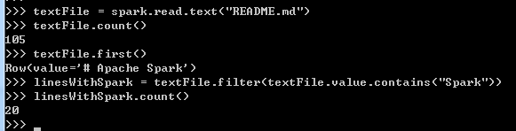

# 快速开始

Spark 2.0之前，Spark的主要编程接口是RDD。在Spark 2.0之后，RDD被Dataset替代，Dataset和RDD一样是强类型，但在底层有更丰富的优化。
强烈建议使用Dataset。

## 使用Spark Shell进行交互式分析

### 基本

Spark的主要抽象是一个名为Dataset的分布式项目集合。可以从HDFS文件或通过其他Dataset来创建Dataset。
Python不需要强类型Dataset,所有Dataset都是Dataset[Row]。

