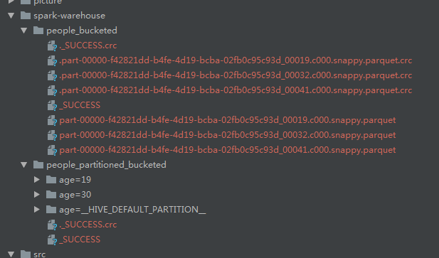

# Spark SQL Guide

Spark SQL是用于结构化数据处理的Spark模块。用途是执行SQL查询，可用于从现有Hive安装中读取数据。
从其他编程语言中运行SQL时，结果作为Dataset和DataFrame返回。还可以使用JDBC与SQL接口进行交互。

Datasets和DataFrames
Dataset是分布式数据集合。可以从JVM对象被构造，然后使用功能性的转换。
DataFrame是一个组织成命名列的Dataset。它在概念上等同于关系数据库中的表。可以从多种来源构建，例如：
结构化数据文件，Hive中的表，外部数据库或现有RDD。
在Java中，DataFrame由Dataset<Row>表示。

## 入门
代码见JavaSparkSQLExample.java
### 起点：SparkSession
Spark中所有功能的入口点都是SparkSession类。要创建基本的SparkSession，只需使用SparkSession.builder():

### 创建DataFrame
使用SparkSession,应用程序可以从现有的RDD，Hive表或Spark数据源创建DataFrame。

### DataFrame操作
除了简单的列引用和表达式之外，数据集还具有丰富的函数库。

### 以编程方式运行SQL查询
该sql上的功能SparkSession使应用程序以编程方式运行SQL查询并返回结果的Dataset<Row>。

### 全局临时视图
可以创建一个全局临时视图，在所有会话之间共享并保持活动状态，直到Spark应用程序终止。
全局临时视图与系统保留的数据库绑定global_temp。

### 创建Datasets
Datasets与RDDs类似，但是不使用Java序列化，而是使用专用的编码器来序列化对象以便通过网络进行处理或传输。
虽然编码器和标准序列化都负责将对象转换为字节，但编码器是动态生成的代码，并使用一种格式，允许Spark执行更多操作，而无须将字节反序列化为对象。

### 与RDD互操作
两种方法将RDD转化为Datasets。
1）使用反射推断模式

2）以编程方式指定架构

### 聚合
可以创建自己的聚合函数
1）无类型用户自定义的聚合函数

2）类型安全的用户定义聚合函数

## 数据源
代码见JavaSQLDataSourceExample.java

Spark SQL支持通过DataFrame接口对各种数据源进行操作。DataFrame可以使用关系转换进行操作，也可以用于创建临时视图。
将DataFrame注册为临时视图允许你对其数据进行SQL查询。

### 通用加载/保存功能
在最简单的形式中，默认数据源将用于所有操作。即不需要指定数据源类型。

1) 手动指定选项
可以手动指定将要使用的数据源以及要传递给数据源的任何其他选项。数据源通过其全名指定，
但内置的来源，你也可以使用自己的短名称（json,parquest,jdbc,orc,libsvm,csv,text）。

2) 直接在文件运行SQL
直接使用SQL查询文件，而不是使用读取API将文件加载到DataFrame并进行查询。

3）保存模式
保存操作可以选择使用saveMode,指定如何处理现有数据。
* "errorifexists" 默认，如果数据已存在，则会引发异常
* "append" 附加到现有内容
* "overwrite" 覆盖
* "ignore" 忽略，不会更改现有数据

4) 保存到持久表
DataFrames也可以使用该saveAsTable命令将持久表保存到Hive Metastore中。不需要现有的Hive部署，会创建默认的本地Hive Metastore(使用Derby)。

saveAsTable保存的文件如图：

5) Bucketing,Sorting和Partitioning
对于基于文件的数据源，可以对输出进行存储和排序或分区。分段和排序仅适用于持久表：

### Parquet文件

### ORC文件

### JSON文件

### Hive表

### JDBC到其他数据库

### Avro文件

### 故障排除

## 性能调优

## 分布式SQL引擎

## 使用Apache Arrow的Pandas PySpark使用指南

## 迁移指南

## 参考