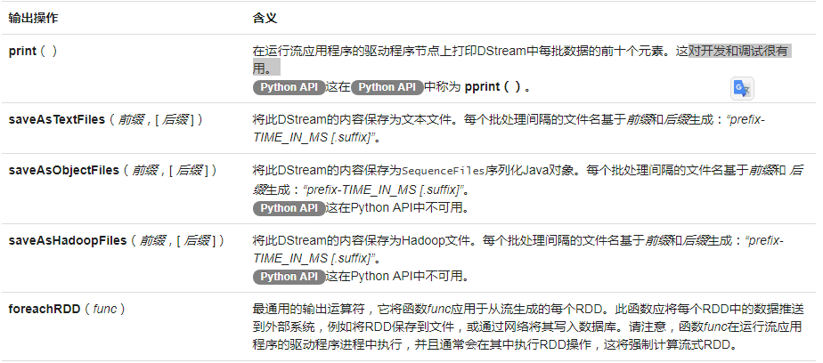

# 第一个Spark Stream程序及本地运行

## window安装netcat

效果：


## 复制官网例子
[官网](https://spark.apache.org/docs/latest/streaming-programming-guide.html#a-quick-example)
代码见JavaNetworkWordCount.java

## 运行结果
启动netcat服务，启动Spark Stream，
在netcat服务端发送数据给Spark Stream程序：

```
C:\Users\Administrator>nc -lp 8888
hello world
```

程序输出结果：


## 调试
断点要打在函数里面，重新往socket发送数据才会进入debug。断点在函数外面怎不进入debug模式。

# 官网文档

## 概观

Spark Streaming 可实现实时数据流的处理，数据可以从许多来源中提取，并且可以使用以高级函数表示的复杂算法进行处理，最后处理后的数据可以推送到文件系统，数据库和实时仪表板。

Spark Streaming接收实时输入数据流并将数据分成批处理，然后由Spark引擎处理以批量生成最终结果流。

## 基本概念

### 链接
maven依赖：
```xml
<dependency>
    <groupId>org.apache.spark</groupId>
    <artifactId>spark-streaming_2.11</artifactId>
    <version>2.4.0</version>
</dependency>
```

### 初始化StreamingContext

StreamingContext对象是所有Spark Streaming功能的主要入口点。

```java
//master是Spark、YARN集群URL，或在本地模式下运行的特殊“local[*]”字符串
SparkConf conf = new SparkConf().setAppName(appName).setMaster(master);
//根据应用程序的延迟要求和可用的集群资源设置批处理间隔
JavaStreamingContext ssc = new JavaStreamingContext(conf, new Duration(1000));
```
定义上下文后，您必须执行以下操作：

1 通过创建输入DStreams来定义输入源。
2 通过将转换和输出操作应用于DStream来定义流式计算。
3 开始接收数据并使用它进行处理streamingContext.start()。
4 等待处理停止（手动或由于任何错误）使用streamingContext.awaitTermination()。
5 可以使用手动停止处理streamingContext.stop()。


### 离散流DStreams

DStreams表示连续的数据流，有一系列连续的RDD表示，应用于DStreams的任何操作都转换为底层RDD上的操作。

### 输入DStreams和Receivers

每个输入DStreams都与Receiver对象相关联，该对象从源接收数据并将其存储在Spark的内存中进行处理。

两类内置流媒体源：
* 基本来源：StreamingContext API中直接提供的源。示例：文件系统和套接字连接。
* 高级资源：Kafka，Flume等资源可通过额外的实用程序类获得。需要引入额外的依赖包。

#### 基本来源

##### 文件流

对于简单的文本文件，最简单的方法是StreamingContext.textFileStream(dataDirectory)。

##### 基于自定义接收器的流

##### RDD作为流的队列

为了测试带有测试数据的Spark Streaming应用程序，还可以使用基于RDD队列创建DStream streamingContext.queueStream(queueOfRDDs)。

#### 高级来源

* Kafka
* Flume
* Kinesis

##### 自定义来源

##### 接收器可靠性

### DStreams的转换

DStreams支持普通Spark RDD上可用的许多转换。

[用到了再看吧](https://spark.apache.org/docs/latest/streaming-programming-guide.html#transformations-on-dstreams)

### DStreams的输出操作



#### 使用foreachRDD的设计模式

```java
//最佳实践
dstream.foreachRDD(rdd -> {
  rdd.foreachPartition(partitionOfRecords -> {
    // ConnectionPool is a static, lazily initialized pool of connections
    Connection connection = ConnectionPool.getConnection();
    while (partitionOfRecords.hasNext()) {
      connection.send(partitionOfRecords.next());
    }
    ConnectionPool.returnConnection(connection); // return to the pool for future reuse
  });
});
```

### DataFrame和SQL操作

可以对流数据使用DataFrames和SQL操作。

### MLlib的运营

可以使用MLlib提供的机器学习算法。

### 缓存/持久化

persist()在DStream上使用该方法将自动将该DStream的每个RDD保留在内存中。

### 检查点

元数据检查点主要用于从驱动程序故障中恢复。

### 累加器，广播变量和检查点


### 部署应用程序


### 监控应用

## 性能调优

### 减少批处理时间

### 设置正确的批次间隔

### 内存调整

## 容错语义

