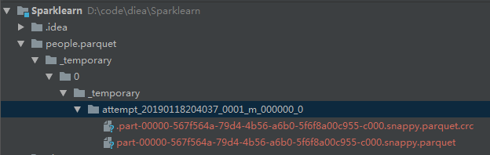
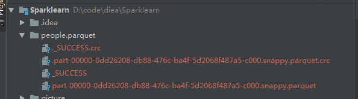
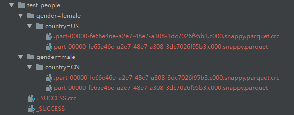

# Spark_Parquest
[官网文档地址](https://spark.apache.org/docs/latest/sql-data-sources-parquet.html)
## 一 window上生成parquet文件报权限不足问题

**问题**
```
Dataset<Row> peopleDF = spark.read().json("src/main/java/org/peter/test/Spark_Parquest/people.json");
// DataFrames can be saved as Parquet files, maintaining the schema information
peopleDF.write().parquet("people.parquet");
```

运行，报错信息如下：
```
java.io.IOException: (null) entry in command string: null chmod 0644 D:\code\diea\Sparklearn\people.parquet\_temporary\0\_temporary\attempt_20190118204037_0001_m_000000_0\part-00000-567f564a-79d4-4b56-a6b0-5f6f8a00c955-c000.snappy.parquet
```
生成文件，如图：


**解决办法**

在 [https://github.com/SweetInk/hadoop-common-2.7.1-bin](https://github.com/SweetInk/hadoop-common-2.7.1-bin) 中下载hadoop.dll，并拷贝到c:\windows\system32目录中

**运行成功**

生成文件，如下图：


该问题应该是只有在window环境下才会出现，后续继续验证。

## 二 读写parquet文件

见LoadingDataProgrammatically.java

## 三 生成有分区的parquet文件

代码见UsePartition.java




